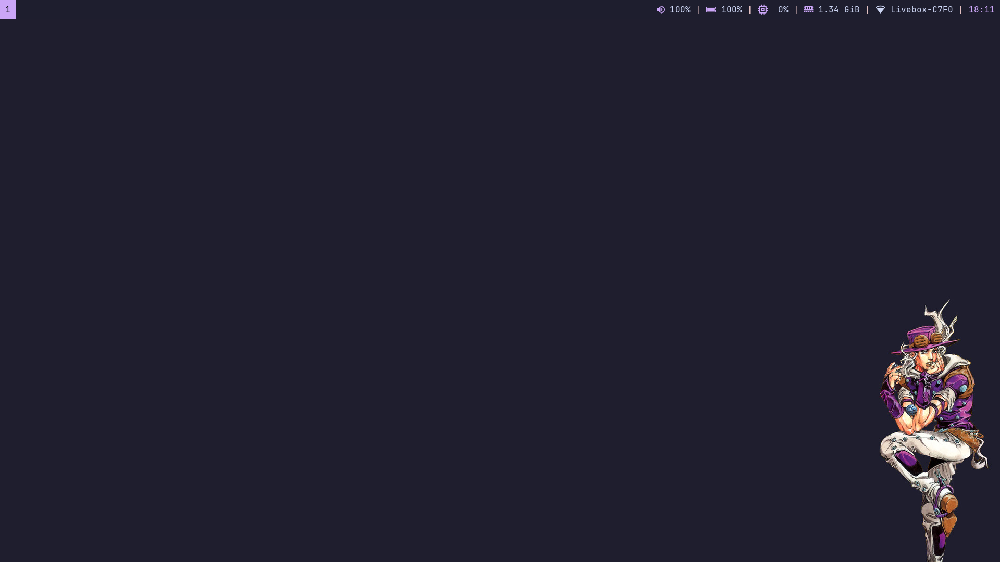

# Workstation Dotfiles
GNU Stow-managed dotfiles for a full Ubuntu/Debian or Arch-based + i3 workstation, with X11 as the primary session model.


## System Overview

This repo is designed as one cohesive, keyboard-first environment rather than a loose set of config files.

The principles used for building this system are simple :

- Keyboard is King
- Distractions are evil
- Defaults are fine

This is all materialized through a set of tools that tries to stay minimal while providing a solid out of the box experience that can be easily extended and customized.
Visually, anything that can be is themed with [Catppuccin](https://github.com/catppuccin), using the Mocha flavor.


- Desktop/Window management:
    - Tiling WM : `i3` 
    - Compositor : `picom`
    - Status bar : `polybar` 
    - App launcher / Menu : `rofi`
    - Notifications : `dunst`
    - Lockscreen : `i3lock`
    - File Manager : `yazi` (via CLI)
- Command Line Interface : 
  - Terminal emulator : `alacritty`
  - Shell : `fish`
  - Prompt : `starship`
  - Enhancements : `tmux`, `lazygit`, `zoxide`, `fzf` and more
- Editing: `neovim` (see [NeoTex README](nvim/.config/nvim/README.md) for details).
- Web : Zen Browser
- AI workflow : OpenCode agent, with integration in Neovim. 
- Workspace-local document/media tabs: PDFs/images are grouped into dedicated i3 tabbed containers per workspace.

The repository includes wallpaper assets under `wallpapers/Pictures/Wallpapers/`.


## Installation Guide

### 1) Prerequisites

You only need `git` to start.

**Ubuntu/Debian:**
```bash
sudo apt update
sudo apt install -y git
```

**Arch / pacman-based:**
```bash
sudo pacman -Syu --needed git
```

### 2) Clone this repo

```bash
git clone <your-repo-url> ~/dotfiles
cd ~/dotfiles
```

### 3) Run bootstrap installer

```bash
./install.sh
```

**For Servers or Headless Systems:**
If you don't want the desktop environment (i3, polybar, fonts, etc.), run:

```bash
./install.sh --headless
```

> [!NOTE]
> The bootstrap installer supports **Ubuntu/Debian** and **Arch-based distros that use `pacman`**.

What this does at a high level:

1. **Detects OS:** Verifies the distro family and uses `apt` or `pacman` as appropriate.
2. **Installs Packages:** Core CLI packages and desktop packages (if not headless), using Arch-specific package lists when running on `pacman`.
3. **Installs Binaries:** Prefers official Arch packages for tools like `neovim`, `fzf`, `starship`, `zoxide`, `yazi`, `lazygit`, `opencode`, and falls back to upstream installers where needed (`zen-browser`, etc.).
4. **Installs Python Tools:** Uses `pipx` to safely install `ipython`, `black`, `isort`, etc.
5. **Configures System:** Adds fonts (optional), sets wallpaper, configures MIME handlers.
6. **Stows Configs:** Enforces the tracked dotfiles into `$HOME`, backing up conflicting existing files to `~/dotfiles-stow-backup-...` when needed.

Installer log: `~/dotfiles/install.log`

### 4) First login checks

1. Log out and back in.
2. Open Neovim and run:
   - `:Lazy sync`
   - `:Mason`
   - `:checkhealth`

> [!NOTE]
> On fresh Arch installs, `nm-applet` expects `NetworkManager.service` to be enabled, and the volume bindings expect a PulseAudio-compatible service that provides `pactl` (PulseAudio itself or PipeWire with `pipewire-pulse`).

> [!IMPORTANT]
> The i3 config swaps `Caps Lock` and `Escape` (`setxkbmap -option caps:swapescape`). If you do not want this behavior, remove that line from `i3/.config/i3/config`.

> [!NOTE]
> The installer force-restows packages by default. If an existing file in `$HOME` conflicts with a tracked dotfile, it is moved to `~/dotfiles-stow-backup-...` and the repo version is stowed in its place.

## Installer Flags

| Flag | Meaning |
|---|---|
| `--headless`, `--no-gui` | Skip desktop/GUI packages (i3, polybar, fonts, wallpapers, Zen browser). |
| `--skip-packages` | Skip system package installation (`apt`/`pacman`). |
| `--skip-tools` | Skip external tool installation (binaries like `starship`, `yazi`, etc.). |
| `--skip-fonts` | Skip Nerd Fonts installation. |
| `--skip-ppas` | Skip adding Ubuntu PPAs (Debian skips PPAs automatically). |
| `--stow-only` | Only run stow (skip all installations). |

Example:

```bash
./install.sh --headless
```

## What `install.sh` Provisions

### Packages (via System Package Manager)
Defined in distro-specific package lists:

- Debian/Ubuntu: `packages/common.txt` and `packages/desktop.txt`
- Arch-based: `packages/common.arch.txt` and `packages/desktop.arch.txt`

- **Core:** `git`, `stow`, `tmux`, `curl`, `wget`, `unzip`, `bc`, compiler/build tooling, `python`, `nodejs`, `npm`, `btop`
- **Desktop:** `i3-wm`, `polybar`, `picom`, `rofi`, `dunst`, `flameshot`, `alacritty`, `fastfetch`, `zathura`, `sxiv`, `qutebrowser`

### External Tools/Binaries
- `neovim` (official prebuilt archive on Debian/Ubuntu; official Arch package on `pacman` systems)
- `fzf` (git clone to `~/.fzf` on Debian/Ubuntu; official Arch package on `pacman` systems)
- `starship` (official installer on Debian/Ubuntu; official Arch package on `pacman` systems)
- `zoxide` (official installer on Debian/Ubuntu; official Arch package on `pacman` systems)
- `yazi` + `ya` (GitHub release binary on Debian/Ubuntu; official Arch package on `pacman` systems)
- `lazygit` (GitHub release binary on Debian/Ubuntu; official Arch package on `pacman` systems)
- `opencode` (official installer on Debian/Ubuntu; official Arch package on `pacman` systems)
- `zen-browser` (official installer)

### Python Tools (via pipx)
Installed in isolated environments to avoid breaking system Python:
- `ipython`, `jupytext`, `black`, `isort`, `pylint`

### Fonts
- `JetBrainsMono Nerd Font`
- `RobotoMono Nerd Font`
- `NerdFontsSymbolsOnly`
- `Font Awesome`

## Stow Packages Applied by Installer

| Package | Target |
|---|---|
| `bash` | `~/.bashrc`, `~/.profile`, `~/.fzf.bash` |
| `fish` | `~/.config/fish/` |
| `starship` | `~/.config/starship.toml` |
| `git` | `~/.gitconfig` |
| `i3` | `~/.config/i3/config` |
| `polybar` | `~/.config/polybar/` |
| `picom` | `~/.config/picom/picom.conf` |
| `rofi` | `~/.config/rofi/` |
| `dunst` | `~/.config/dunst/dunstrc` |
| `alacritty` | `~/.config/alacritty/alacritty.toml` |
| `nvim` | `~/.config/nvim/` |
| `yazi` | `~/.config/yazi/` |
| `zathura` | `~/.config/zathura/` |
| `lazygit` | `~/.config/lazygit/config.yml` |
| `fontconfig` | `~/.config/fontconfig/fonts.conf` |
| `fastfetch` | `~/.config/fastfetch/config.jsonc` |
| `btop` | `~/.config/btop/btop.conf` |
| `tmux` | `~/.config/tmux/tmux.conf` |
| `systemd` | `~/.config/systemd/user/tmux.service` |
| `qutebrowser` | `~/.config/qutebrowser/` |
| `xdg-desktop-portal` | `~/.config/xdg-desktop-portal/portals.conf` |
| `xdg-desktop-portal-termfilechooser` | `~/.config/xdg-desktop-portal-termfilechooser/` |
| `latex` | `~/texmf/` (custom `.bst` files) |
| `scripts` | `~/.local/bin/` and `~/.local/share/applications/` |
| `wallpapers` | `~/Pictures/Wallpapers/` |
| `opencode` | `~/.config/opencode/opencode.json` |

> [!NOTE]
> Use `bash scripts/.local/bin/force-stow-dotfiles` any time you want to re-apply the repo aggressively after a distro installer or another tool has recreated config files under `$HOME`.

## Manual Setup Checklist

These items are either manual setup or useful post-install checks.

### 1) `xdg-desktop-portal-termfilechooser` backend (for Yazi file picker)

The config is stowed, and the normal desktop install now pulls in this backend's runtime + build dependencies. On Debian/Ubuntu that means packages like `meson`, `ninja-build`, `libinih-dev`, `libsystemd-dev`, `scdoc`; on Arch it uses the `pacman` equivalents.

The backend binary itself still needs a one-time manual install in this bootstrap flow. Ubuntu/Debian do not ship a standard package for `xdg-desktop-portal-termfilechooser`, and Arch users typically install it from AUR or from source.

If you installed with `--headless`/`--no-gui`, install those dependencies first before building the backend manually.

Then build and install it once from source:

```bash
git clone https://github.com/boydaihungst/xdg-desktop-portal-termfilechooser.git /tmp/xdptf
cd /tmp/xdptf
meson setup build
ninja -C build
sudo ninja -C build install
```

If `meson setup` complains about manpage tooling, retry with:

```bash
meson setup build -Dman-pages=disabled
```

Then relogin, or run:

```bash
systemctl --user import-environment DISPLAY XAUTHORITY XDG_CURRENT_DESKTOP XDG_SESSION_TYPE XDG_RUNTIME_DIR DBUS_SESSION_BUS_ADDRESS I3SOCK PATH
dbus-update-activation-environment --systemd DISPLAY XAUTHORITY XDG_CURRENT_DESKTOP XDG_SESSION_TYPE XDG_RUNTIME_DIR DBUS_SESSION_BUS_ADDRESS I3SOCK PATH
systemctl --user restart xdg-desktop-portal-termfilechooser.service
```

### 2) Machine-specific monitor config

Create `~/.config/i3/local.conf` for monitor/layout overrides:

```bash
cat > ~/.config/i3/local.conf << 'EOF'
# Example
exec --no-startup-id xrandr --output eDP-1 --off --output HDMI-1 --auto
EOF
```

### 3) Polybar hardware names

`polybar/.config/polybar/config.ini` uses auto-detection by default:

- Wireless interface is auto-detected in `polybar/.config/polybar/launch_polybar.sh` and exported as `POLYBAR_WLAN_INTERFACE`.
- Battery/AC names are auto-detected in `polybar/.config/polybar/launch_polybar.sh` and exported as `POLYBAR_BATTERY`/`POLYBAR_ADAPTER`.

If needed, you can still override manually via environment variables before launching polybar.

### 4) Workspace-local PDF/image tabs.

`zathura-tabbed` and `sxiv-tabbed` use native i3 tabbed containers. 

Behavior per workspace:

- First opened PDF/image creates a dedicated tabbed container for PDFs/images in that workspace.
- Any subsequent PDF/image opened via `xdg-open` in that workspace is appended as a new tab in the matching container.
- Tab titles are normalized to basename-only (for example `paper.pdf`, `figure.png`).

### 5) Zen Browser

Zen is installed automatically by `install.sh` when using the desktop profile.
Expected install locations:
- `~/.tarball-installations/zen`
- `~/.local/bin/zen`

### 7) CUDA (optional)

Shell configs auto-detect `/usr/local/cuda-12.8` or `/usr/local/cuda` and update `PATH` / `LD_LIBRARY_PATH`.

## Machine-Local Overrides (Recommended)

Keep personal and machine-specific values in local files, not in this public repo:

- Git identity/settings: `~/.gitconfig.local` (included by `~/.gitconfig`)
- Fish local env vars/secrets: `~/.config/fish/local.fish` (sourced from `config.fish` if present)

Example for `~/.config/fish/local.fish`:

```fish
set -gx GOOGLE_VERTEX_PROJECT your-project-id
set -gx GOOGLE_VERTEX_LOCATION global
set -gx GOOGLE_APPLICATION_CREDENTIALS $HOME/.config/gcloud/application_default_credentials.json
```

`~/.config/fish/local.fish` is machine-local and intentionally not tracked in git.
